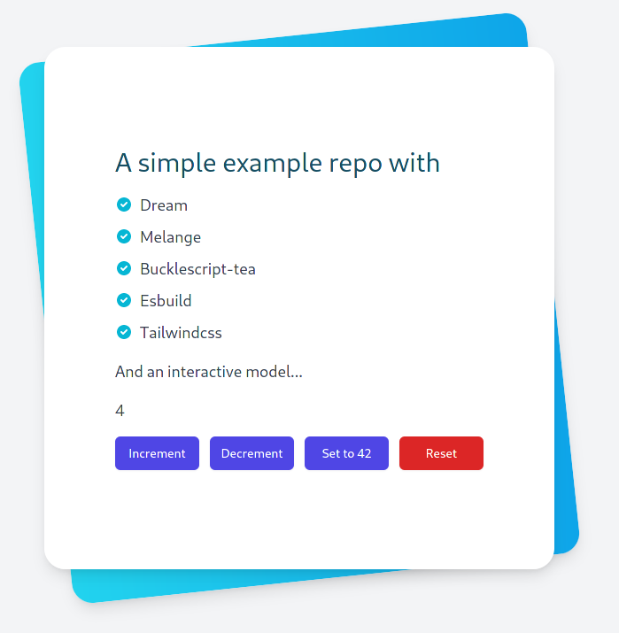

# `dream-melange-tea-tailwind`



An example repo with that integrates [dream](https://github.com/aantron/dream) and [melange](https://github.com/melange-re/melange) with [bucklescript-tea](https://github.com/OvermindDL1/bucklescript-tea),
build with [esbuild](https://esbuild.github.io) and integrating [tailwindcss](https://tailwindcss.com/)

To install, do

```bash
npm install
```

if you have [watchexec](https://github.com/watchexec/watchexec) installed, you can run `npm run dev`
to have watch mode enabled. This will rebuild on changes in the `client` and `server` directory.

or run `npm run start` without watchmode

Then visit [http://localhost:8080](http://localhost:8080)


